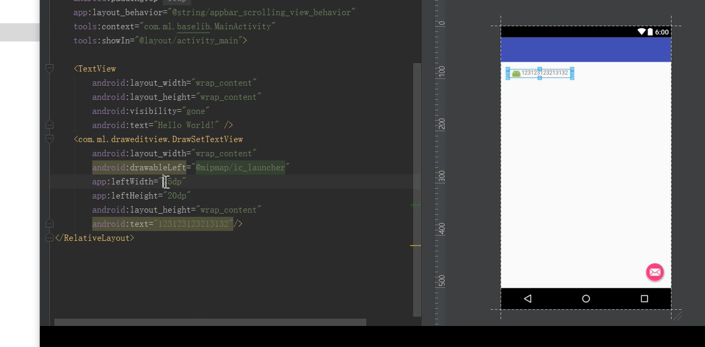
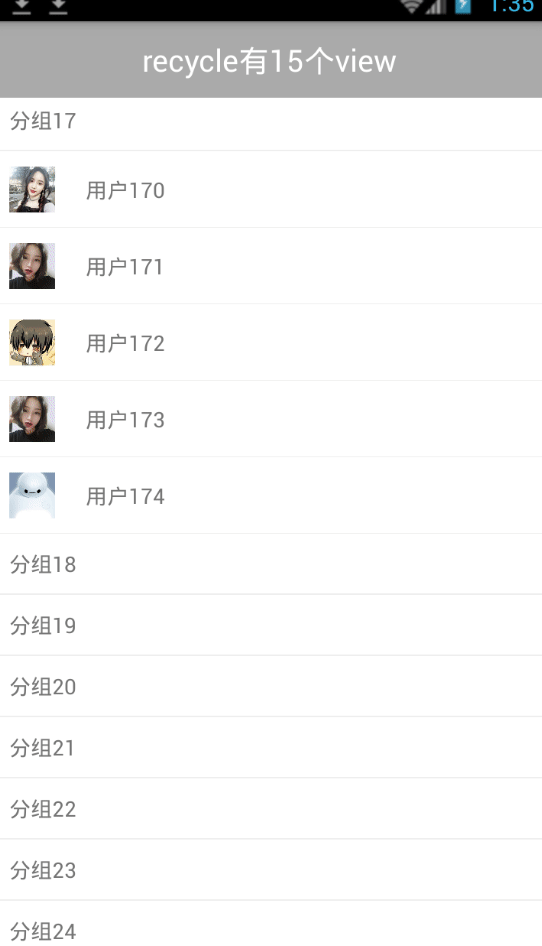

# 常用的一些效果
在xml文件中，动态的设置TextView  EditView  Button等的  CompoundDrawables的 大小，
，方便调试
 
DrawSetEditView链接(https://github.com/MengLeiGitHub/DrawSetEditView/blob/master/BaseLib/draweditview/README.MD)

# 最简单实现 类似QQ分组效果

通过改写RecyclerView.Adapter实现，所以需要先引入RecyclerView包
链接(https://github.com/MengLeiGitHub/DrawSetEditView/blob/master/BaseLib/qqgroupdemo/GROUP.md)
